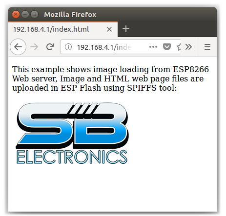

# ESP-Image
Show an image on a ESP8266 Web Server using ESP8266FS plugin.

## Installation
- Make sure you have ESP8266 core installed.
- Download ESP8266FS plugin from [here](https://github.com/esp8266/arduino-esp8266fs-plugin/releases/download/0.3.0/ESP8266FS-0.3.0.zip).
- In your Arduino sketchbook directory, create tools directory if it doesn't exist yet.
- Unpack the tool into tools directory (the path will look like `<home_dir>/Arduino/tools/ESP8266FS/tool/esp8266fs.jar)`.
- Restart Arduino IDE.

## Usage
- Open "Image.ino" sketch and upload it.
- Connect to "image" WiFi and enter to 192.168.4.1. Ready!

## Screenshot

## Credits

- Thanks to Hristo Gochkov and Ivan Grokhotkov for [ESP8266FS Plugin](https://github.com/esp8266/arduino-esp8266fs-plugin).
